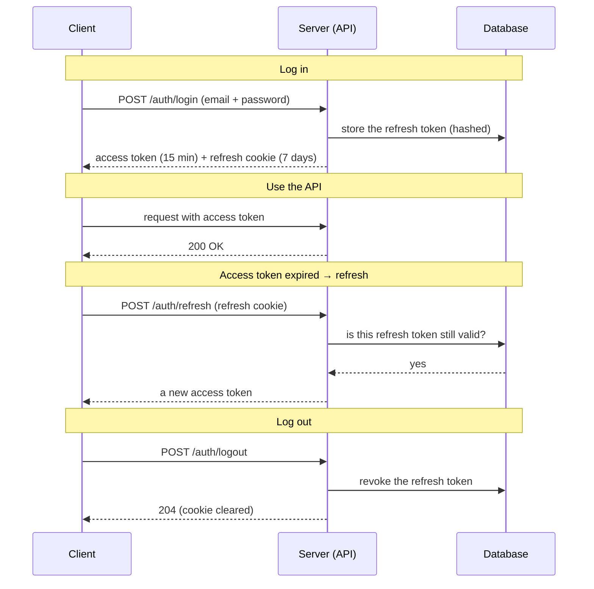

# Hotel Booking System

A hotel booking REST API built with **.NET 10** and **Clean Architecture**. Guests search hotels, book rooms and manage their bookings; admins manage cities, hotels, room types, rooms and amenities.

[Example guidance taken from](https://medium.com/@mohanedzekry/clean-architecture-in-asp-net-core-web-api-d44e33893e1d)


## Table of Contents

- [About the Project](#about-the-project)
- [Built With](#built-with)
- [Getting Started](#getting-started)
- [API Endpoints](#api-endpoints)
- [Adding a New Feature](#adding-a-new-feature)
- [Project Structure](#project-structure)
- [Running the Tests](#running-the-tests)
- [Roadmap](#roadmap)
- [Deep Dives](#deep-dives)

## About the Project

### Features

- **Clean Architecture**: dependencies point inward only (Api → Infrastructure → Core → Contracts)
- **CQRS**: every use case is a command or a query with its own handler
- **Result pattern**: expected failures (not found, conflict, validation) are returned, not thrown
- **One response shape**: `{ "data": … }` for success, `{ "status", "message" }` for errors
- **Auth**: own `User` entity, PBKDF2 password hashing, JWT access tokens + refresh tokens, `User`/`Admin` roles
- **Validation** with FluentValidation, returned as `400` with per-field `errors`
- **Auditing and soft delete**: created/updated by and at are set automatically; deleted rows are hidden, not removed
- **Structured logging** with Serilog
- **Global exception handling**: unexpected errors become a logged `500` with the same error shape
- **Idempotent checkout**: a client `Idempotency-Key` makes a retried booking safe — the same key returns the original booking, never a second one
- **Featured deals**: admins add percentage or fixed-amount discounts; the public home page ranks the active ones, **cached in Redis**

### Response format

```jsonc
// success (single)
{ "data": { "id": 1, "name": "Jenin", "country": "Palestine" } }

// success (paged) — meta is a SIBLING of data
{ "data": [ … ], "meta": { "page": 1, "pageSize": 25, "totalCount": 42 } }

// failure
{ "status": 404, "message": "The city with ID '99' was not found." }
```

## Built With

| Area | Technology |
|---|---|
| Framework | .NET 10, ASP.NET Core (controllers) |
| Database | SQL Server 2022 (Docker), EF Core 10 |
| Cache | Redis via `IDistributedCache` (optional — falls back to in-process) |
| Auth | JWT bearer + refresh tokens, PBKDF2 hashing |
| Validation | FluentValidation |
| Logging | Serilog |
| API docs | Swagger (Swashbuckle) |
| Tests | xUnit, NSubstitute, Shouldly, NetArchTest |

## Getting Started

### Prerequisites

Install these once:

- [.NET SDK 10.0.400+](https://dotnet.microsoft.com/download)
- [Docker Desktop](https://www.docker.com/products/docker-desktop/) (for SQL Server)
- The EF Core CLI, used to create the database and add migrations:

  ```bash
  dotnet tool install --global dotnet-ef
  ```

### 1. Configure secrets

Create a `.env` file in the repository root — Docker Compose reads it for the SQL Server password:

```
MSSQL_SA_PASSWORD=<a strong password>
```

Store the connection string and the JWT signing key in **user-secrets** so they never land in `appsettings.json`. The connection string is needed by both the API (to run) and the Infrastructure project (to run migrations):

```bash
# Connection string — API + migrations
dotnet user-secrets set "ConnectionStrings:HotelBookingDb" "Server=localhost,1434;Database=HotelBookingSystem;User Id=sa;Password=<password>;TrustServerCertificate=True" --project src/HotelBooking.Api
dotnet user-secrets set "ConnectionStrings:HotelBookingDb" "Server=localhost,1434;Database=HotelBookingSystem;User Id=sa;Password=<password>;TrustServerCertificate=True" --project src/HotelBooking.Infrastructure

# JWT signing key — required, validated on startup (Issuer/Audience/lifetimes live in appsettings.json)
dotnet user-secrets set "JWT:SecretKey" "<a random string of at least 32 characters>" --project src/HotelBooking.Api
```

### 2. Start SQL Server

It listens on port `1434` (so it does not clash with a local SQL install on `1433`):

```bash
docker compose up -d
```

### 3. Create the database

```bash
dotnet ef database update --project src/HotelBooking.Infrastructure --startup-project src/HotelBooking.Infrastructure
```

### 4. Run the API

```bash
dotnet run --project src/HotelBooking.Api
```

Swagger: http://localhost:5209/swagger

> **Sample data (Development only):** run with `-- --reseed` to migrate and seed demo cities, hotels, rooms, discounts and an admin account in one go:
> ```bash
> dotnet run --project src/HotelBooking.Api -- --reseed
> ```

### Optional: Redis for caching

The featured-deals cache uses Redis when a Redis connection string is configured, and an in-process cache otherwise — **presence of the connection string is the switch**, there is no on/off flag. `docker compose up -d` already starts a Redis container next to SQL Server; point the app at it in user-secrets:

```bash
dotnet user-secrets set "ConnectionStrings:Redis" "localhost:6379" --project src/HotelBooking.Api
```

Leave it unset to run the cache in-process — fine for a single instance, and what the tests do.

## API Endpoints

Base URL: `/api/v1`. The **Auth** column is `Anonymous`, `Authenticated` (any signed-in user) or `Admin` (the `Admin` role). Endpoints in the `admin/*` area require `Admin` **unless** the table says otherwise — a few reads and nested writes fall back to `Authenticated`.

### Auth

| Method | Route | Auth | Description | Success |
|---|---|---|---|---|
| `POST` | `/auth/register` | Anonymous | Create a guest account | `201` `{id}` |
| `POST` | `/auth/login` | Anonymous | Log in; refresh token is set as an **HttpOnly cookie** | `200` `{accessToken, expiresAtUtc}` |
| `POST` | `/auth/refresh` | Anonymous | Exchange the refresh cookie for a new access token | `200` |
| `POST` | `/auth/logout` | Authenticated | Revoke the refresh token and clear the cookie | `204` |
| `GET`  | `/auth/me` | Authenticated | The signed-in user and their role | `200` |

Common errors: `400` invalid input · `401` bad credentials / expired or revoked token · `409` email already registered.

### Cities

| Method | Route | Auth | Description | Success |
|---|---|---|---|---|
| `GET` | `/admin/cities` | Authenticated | Paged, searchable, sortable list | `200` |
| `GET` | `/admin/cities/{id}` | Authenticated | One city | `200` |
| `POST` | `/admin/cities` | Admin | Create a city | `201` |
| `PUT` | `/admin/cities/{id}` | Admin | Replace name, country, post office | `204` |
| `DELETE` | `/admin/cities/{id}` | Admin | Soft delete | `204` |

### Amenities

| Method | Route | Auth | Description | Success |
|---|---|---|---|---|
| `GET` | `/admin/amenities` | Admin | The full catalogue | `200` |
| `POST` | `/admin/amenities` | Admin | Add an amenity | `201` |
| `DELETE` | `/admin/amenities/{id}` | Admin | Soft delete | `204` |

### Hotels (admin)

| Method | Route | Auth | Description | Success |
|---|---|---|---|---|
| `GET` | `/admin/hotels` | Admin | Owner's hotels: paged, searchable, sortable | `200` |
| `POST` | `/admin/hotels` | Admin | Create a hotel | `201` |
| `GET` | `/admin/hotels/{id}` | Admin | One hotel, for the edit form | `200` |
| `PUT` | `/admin/hotels/{id}` | Admin | Replace every field | `204` |
| `PUT` | `/admin/hotels/{id}/amenities` | Admin | Replace the hotel's amenity set | `204` |
| `POST` | `/admin/hotels/{id}/attractions` | Authenticated | **Add a map pin;** distance from the hotel is computed and stored | `201` |
| `DELETE` | `/admin/hotels/{id}/attractions/{attractionId}` | Authenticated | Remove a map pin | `204` |
| `POST` | `/admin/hotels/{id}/discounts` | Admin | **Add a discount** (percentage or fixed amount); it feeds featured deals while active | `201` |
| `DELETE` | `/admin/hotels/{id}/discounts/{discountId}` | Admin | Remove a discount | `204` |
| `DELETE` | `/admin/hotels/{id}` | Admin | Soft delete | `204` |

### Room types (admin)

Nested under a hotel; the ownership check runs on the parent hotel.

| Method | Route | Auth | Description | Success |
|---|---|---|---|---|
| `GET` | `/admin/hotels/{hotelId}/room-types` | Authenticated | Every type, cheapest first | `200` |
| `POST` | `/admin/hotels/{hotelId}/room-types` | Authenticated | Add a type | `201` |
| `PUT` | `/admin/hotels/{hotelId}/room-types/{id}` | Authenticated | Replace a type's fields | `204` |
| `DELETE` | `/admin/hotels/{hotelId}/room-types/{id}` | Authenticated | Soft delete (`409` if rooms still use it) | `204` |

### Rooms (admin)

| Method | Route | Auth | Description | Success |
|---|---|---|---|---|
| `GET` | `/admin/hotels/{hotelId}/rooms` | Admin | The hotel's rooms grid | `200` |
| `POST` | `/admin/hotels/{hotelId}/rooms` | Admin | Add a room (`409` on a duplicate number) | `201` |
| `PUT` | `/admin/hotels/{hotelId}/rooms/{id}` | Admin | Change number or type | `204` |
| `DELETE` | `/admin/hotels/{hotelId}/rooms/{id}` | Admin | Soft delete | `204` |

### Users (admin)

| Method | Route | Auth | Description | Success |
|---|---|---|---|---|
| `GET` | `/admin/users` | Admin | Paged list (`pageSize` defaults to **20**) | `200` |

### Bookings

The signed-in guest's own bookings; the API takes the user from the token, so no user id is ever sent and another user's booking answers `404` (not `403`).

| Method | Route | Auth | Description | Success |
|---|---|---|---|---|
| `POST` | `/bookings` | Authenticated | **Checkout.** Books the rooms in the request as one booking, one hotel. Requires an `Idempotency-Key` header | `201` new · `200` on a replayed key |
| `GET` | `/bookings/my-bookings` | Authenticated | My bookings, newest first (paged) | `200` |
| `GET` | `/bookings/{id}/confirmation` | Authenticated | One booking's confirmation page — only if it's mine | `200` |

Checkout errors: `400` unknown room type, guests that don't fit, past/out-of-order dates, or a missing `Idempotency-Key` · `409` a room type sold out for those dates.

### Hotels, search & home (public)

| Method | Route | Auth | Description | Success |
|---|---|---|---|---|
| `GET` | `/hotels/{id}` | Anonymous | The guest hotel page: details, amenities and **nearby attraction pins** | `200` |
| `GET` | `/hotels/{id}/rooms` | Anonymous | Each room type with its price and **how many rooms are free** for the dates | `200` |
| `GET` | `/search/hotels` | Anonymous | Hotels with enough free rooms for the guests and dates, filtered and sorted | `200` |
| `GET` | `/home/featured-deals` | Anonymous | Up to 5 hotels with an active discount, best saving first. Cached ~5 min | `200` |

Common errors across the API: `400` validation · `401` no/expired token · `403` wrong role · `404` not found · `409` conflict.

## Adding a New Feature

The project is a set of vertical slices. Adding one is mostly **additive** a new folder under `Features/`, a couple of DTOs, and a controller (or a new action on an existing one). Nothing scans or wires by hand: **validators and command/query handlers are discovered by assembly scanning** in `Core/DependencyInjection.cs`, so a new handler is live the moment it compiles.

The order below is the one that keeps merges clean. It is exactly how the *nearby attractions* slice was built.

1. **Map out what you need.** Name the use cases (commands that change state, queries that read), the data they touch, and the shape the client sends and receives. Write these down before touching code.

2. **Add the domain entities.** New classes under `Core/Domain/Entities`, with private setters and a static factory that guards its invariants (see `NearbyAttraction.cs`: it trims and rejects empty name/category, and stores the computed distance).

3. **Expose them on the DbContext.** Add a `DbSet<T>` to `AppDbContext` (and to the `IAppDbContext` abstraction that the Application layer talks to).

4. **Add the EF configuration.** One `IEntityTypeConfiguration<T>` per entity under `Infrastructure/Persistence/Configurations` keys, lengths, relationships, indexes (see `NearbyAttractionConfiguration.cs`).

5. **Touch neighbouring entities if the change needs it.** If an existing entity gains a relationship (e.g. `Hotel` gaining a collection of attractions), edit that entity **and its configuration** to match. Keep the change small and deliberate.

6. **Add the DTOs to Contracts.** Request records and response records under `HotelBooking.Contracts/<Feature>/` — this project has no dependencies, so it is safe for both the Api and any client to reference.

7. **Create the feature folder.** `Core/Application/Features/<Feature>/`, with `Commands/` and `Queries/` subfolders per use case.

8. **Declare the expected errors.** A static `…Errors` class in the feature folder returning `Error` values (`NotFound`, `Conflict`, …) so handlers return them through the `Result` instead of throwing.

9. **Write each use case.** For a command or query, add three files: the **command/query** (a record of its inputs), its **handler**, and its **validator** (FluentValidation). No manual registration — the assembly scan picks up the handler and the validator.

10. **Wire the HTTP surface.** Add a thin controller under `Api/Controllers` (or an action on an existing one) that maps request DTO → command/query → handler → `Result` → HTTP. Add `[Authorize(Roles = …)]` where the endpoint needs a role. Document responses with `[ProducesResponseType]` for Swagger.

11. **Migrate.** `dotnet ef migrations add <Name> --project src/HotelBooking.Infrastructure --startup-project src/HotelBooking.Infrastructure`, then `database update`.

## Project Structure

```
src/
  HotelBooking.Api             → controllers, middleware, Swagger, startup, DI composition
  HotelBooking.Core            → Domain (entities, rules) + Application (Features/<F>/Commands|Queries, Abstractions)
  HotelBooking.Infrastructure  → EF Core, SQL Server, migrations, auditing, JWT + refresh tokens, hashing
  HotelBooking.Contracts       → request and response DTOs, no dependencies
tests/
  HotelBooking.Tests           → Unit/, Integration/, Architecture/
docs/                          → build guide (guide/) and reference (architecture, database, decisions)
```

## Running the Tests

```bash
dotnet test
```

## Roadmap

- [x] Foundation: solution, Result/Error, EF Core, create and get a city
- [x] Response envelope, logging, global exception handling
- [x] Auditing and soft delete; update and delete a city
- [x] Admin grid for cities (paging, search, sort)
- [x] Authentication: own user, PBKDF2, JWT, roles, refresh tokens
- [x] Catalog: hotels, room types, rooms, amenities
- [x] Search and the public hotel page (availability, nearby attractions)
- [x] Checkout and bookings (idempotent), confirmation, my bookings
- [x] Home page — featured deals + discounts (Redis cache) · ⏳ recently visited, trending, reviews
- [ ] Own mediator (ISender) and pipeline behaviors
- [ ] Concurrency: no double-booking
- [ ] Images, confirmation email, PDF invoice
- [ ] Seq, health checks, Docker image, CI

# Deep Dives

## Auth: JWT access tokens + refresh tokens

Two tokens do two jobs:

- **The access token** is a short-lived JWT (15 min). It is sent on every request as `Authorization: Bearer …` and validated **without a database call** — the signature and expiry are enough.
- **The refresh token** is a long-lived (7 days), random, opaque string. It is **not** a JWT; it exists only to get a fresh access token when the old one expires, so the user is not forced to log in again every 15 minutes.

**Why keep them separate?** If the access token were long-lived, a leaked one would stay valid for days with no way to pull it back, it is never checked against the database. Keeping it short means a leak is useful for minutes. The refresh token *is* stored (hashed) in the database, so it can be revoked on logout. Short access token + revocable refresh token = the best of both.

### The lifecycle: login → refresh → logout


```mermaid
sequenceDiagram
    participant C as Client
    participant S as Server (API)
    participant DB as Database

    Note over C,DB: Log in
    C->>S: POST /auth/login (email + password)
    S->>DB: store the refresh token (hashed)
    S-->>C: access token (15 min) + refresh cookie (7 days)

    Note over C,DB: Use the API
    C->>S: request with access token
    S-->>C: 200 OK

    Note over C,DB: Access token expired → refresh
    C->>S: POST /auth/refresh (refresh cookie)
    S->>DB: is this refresh token still valid?
    DB-->>S: yes
    S-->>C: a new access token

    Note over C,DB: Log out
    C->>S: POST /auth/logout
    S->>DB: revoke the refresh token
    S-->>C: 204 (cookie cleared)
```

The access token is short-lived and never touches the database; the refresh token is stored so it can be checked on refresh and revoked on logout. **Token rotation** — issuing a *new* refresh token on every use — is the next hardening step (see notes below).


## Idempotent checkout: one booking per key, however many retries

A network drops after the booking is saved but before the response arrives; the app retries. Without protection, that's a second booking for the same room. The fix is an **idempotency key** the *client* owns:

- The client mints one GUID per checkout attempt and sends it as an `Idempotency-Key` header. Every retry of that attempt carries the **same** key.
- The API stores the key on the booking (a unique column). On checkout it first looks for a booking with that key: found → return the original (`200`, `isNew: false`); not found → create it (`201`, `isNew: true`).
- So a double-click, a retried request after a timeout, or a resubmitted form all resolve to the **one** booking that key created.

The key must be minted **once, by the caller**, and frozen for the life of the attempt. Generating it server-side per request would defeat the whole point — every retry would look new.

## Caching featured deals in Redis

The home page's featured deals are the same for every visitor and change rarely — the textbook case for a cache. The handler wraps the query in a get-or-create against `IDistributedCache`:

- **Key** includes today's date (`home:featured-deals:20260925`), so a deal that ends tonight can't be served tomorrow — tomorrow's first request is a miss by construction.
- **TTL** ~5 minutes. Adding or removing a discount clears **today's key** so the change shows on the next load.
- **Where it lives:** Redis when `ConnectionStrings:Redis` is set (shared across instances), an in-process cache otherwise. Callers only ever see `IDistributedCache`, so which one is behind it changes no code.

Deliberately simple (decision **D-25**): one cache tier, one TTL, invalidate by key — no in-process L1, no cache tags, no on/off flag.

---

# Detail Explanatory

## file: `HotelBooking.Infrastructure/Security/JwtTokenService.cs`

- This is the implementation of the ITokenService in the Abstractions in the Cores's Application.
- It is the modern way to implement the new Json Web Token with the new .NET DI TimeProvider.
- This new handler uses less memo, and more optimized.
- Extraction of the injected IOptions from the configuration.
- Then we generate the token using Crypto generation keys.

----
Refresh tokens info:
https://javascript.plainenglish.io/securing-your-app-with-access-and-refresh-tokens-a-practical-guide-41d239ee5085

What does Token Rotation mean:

In simple terms its like a key defense that every time someone uses a refresh token:

1. Issue a new access token and a new refresh token
2. Mark the old refresh token as “used”

#### Why storing in Unicode?
- used for storing cryptographic hashes (like SHA-256), which are always a predictable string of alphanumeric characters and fixed in length.
-----
# Tests
### Unit tests
- Used AI to generate unit tests.